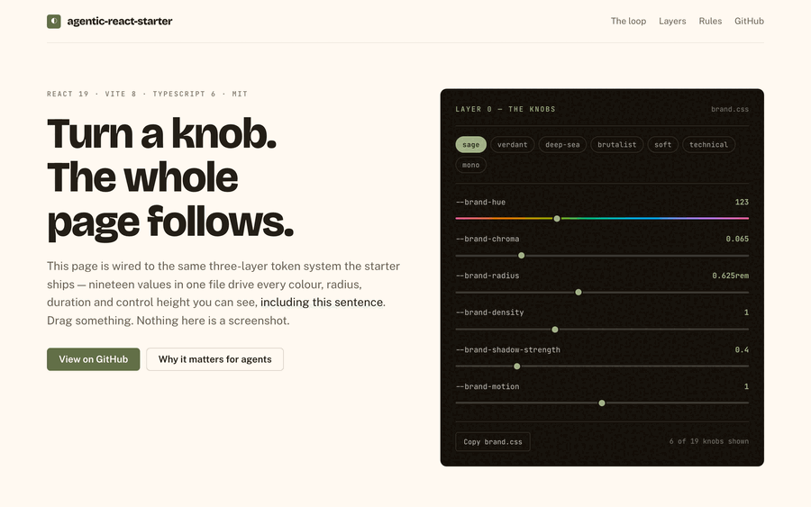

# Agentic React Starter

[](https://github.com/swapnil-saal/agentic-react-starter/actions/workflows/ci.yml)
[](LICENSE)
[](https://github.com/swapnil-saal/agentic-react-starter/generate)

### One file's 19 knobs restyle the entire app. Every component is source you own.



Every frame above is the same build — no rebuild, no theme file, nothing
swapped out. **[Turn the knobs yourself →](https://swapnil-saal.github.io/agentic-react-starter/)**

A Vite + React 19 + TypeScript starter on [Base UI](https://base-ui.com)
primitives, with a three-layer token system and a Claude Code agent layer that
enforces the rules on every edit.

## Quick start

```bash
pnpm install
cp .env.example .env
pnpm doctor        # installs/verifies the agent toolchain
pnpm dev
```

Open http://localhost:5173 and look around.

## Starting your own app

The clone ships with example screens so you can see the patterns working.
When you're ready to build, strip them:

```bash
pnpm reset --dry-run   # see exactly what it would change
pnpm reset             # do it
```

That removes the example routes (`/users`, `/form-demo`), the marketing home
page, the feature module behind them, and the tests that cover them — then
leaves you a blank home. It keeps the parts that are infrastructure:

| Kept                 | Why                                                |
| -------------------- | -------------------------------------------------- |
| `src/design-system/` | the whole point — your components and tokens       |
| `/components`        | living style guide; how you see your design system |
| `/brand`             | brand settings and the contrast audit              |
| `src/mocks/`         | wiring intact, handlers emptied — add your own     |

It refuses to run on a dirty tree, so `git checkout .` is always an undo.

Then:

1. **Rename the project in `package.json`** — the sidebar, header and browser
   title all follow it.
2. **Set your brand** at `/brand`, export, and save over
   `src/design-system/brand.css`.
3. `pnpm check && pnpm e2e`.

Files that `pnpm reset` removes carry an `EXAMPLE` header, so it's obvious
what is scaffolding even before you run it.

## The idea

Most starters hand you someone else's component library. You can restyle it
from the outside, but you cannot change how it works — and when your design
diverges from its opinions, you end up fighting it.

Here, **every component is source in this repo**. They are built on
[Base UI](https://base-ui.com) headless primitives, which supply the genuinely
hard parts — focus management, keyboard navigation, positioning, ARIA wiring —
while styling and API are yours. Point an agent at `src/design-system/` and ask
it to build your design system on top; there is nothing to fight.

## What's in it

**Application**

- Vite 8, React 19, TypeScript 6
- ~37 owned components on Base UI primitives, styled with Tailwind v4 + CVA
- A shared motion vocabulary, so one knob can slow or disable every animation
- A brand layer: 19 knobs in one file restyle the entire app
- Light, dark and follow-the-OS themes from a single set of declarations
- TanStack Router (file-based, fully typed) + TanStack Query
- React Hook Form + Zod, including boot-time environment validation
- A worked data layer: typed queries, an optimistic mutation with rollback, and
  an MSW mock API so it runs with no backend — served to the browser and to
  Vitest from one set of handlers
- Forms that handle both halves: Zod client validation and server-side field
  errors mapped back onto the field that caused them
- Route-level error and not-found pages, and a drawer nav on small screens
- Vitest + Testing Library + Playwright, with four unit-test archetypes to copy
- An axe accessibility scan over every route, in light and dark
- ESLint 10, Prettier, Husky, lint-staged

**Agent layer**

- [CodeGraph](https://colbymchenry.github.io/codegraph) — the repo indexed as a
  queryable graph over MCP, so the agent traces callers and impact rather than
  grepping
- [Ponytail](https://github.com/DietrichGebert/ponytail) — a Claude Code plugin
  that biases toward writing minimal, necessary code
- Five project skills in `.claude/skills/`: the design system, UI design
  standards, React patterns, testing, and the routing workflow
- A `PostToolUse` hook that checks design tokens on every file the agent edits,
  so a violation lands in the tool result instead of at the end of the task
- `/new-component` — scaffolds a component against the recipe and verifies it

Everything is free and works offline. No account, no paid tier, no API key.

## One file defines the look

`src/design-system/brand.css` is the only file a new project needs to edit.
19 knobs drive the entire UI. The shipped defaults are the Sage preset:

```css
--brand-hue: 123; /* colour ramps generated in OKLCH   */
--brand-chroma: 0.065; /* 0 grey · 0.13 vivid · 0.25 neon   */
--brand-radius: 0.625rem; /* 0 sharp → 1.5rem pillowy          */
--brand-border-width: 1px;
--brand-font: 'Inter', …;
--brand-type-ratio: 1.15; /* modular scale for every heading   */
--brand-density: 1; /* control heights AND all spacing   */
--brand-shadow-strength: 0.4; /* 0 flat → 2 floating               */
--brand-motion: 1; /* 0 disables every transition       */
--brand-ease: cubic-bezier(0.16, 1, 0.3, 1);
```

The rest: `--neutral-hue`, `--neutral-chroma`, `--status-chroma`,
`--brand-field-border-width`, `--brand-font-mono`, `--brand-font-heading`,
`--brand-text-base`, `--brand-heading-weight`, `--brand-heading-tracking`.

Change one number and the whole app follows — in light and dark together.
Same components, a different product.

**Presets.** `src/design-system/presets/` ships seven complete looks —
`sage` (the default), `verdant`, `deep-sea`, `brutalist`, `soft`, `technical`
and `mono`. Copy one over the `:root` block in `brand.css` to adopt it, or
preview them all at `/brand`.

Got a look of your own? **[Contribute a preset](CONTRIBUTING.md#contributing-a-preset)**
— it is one CSS file and a screenshot.

**Settings page.** Run `pnpm dev` and open **`/brand`**. It drives the real
component library — not a mock — and includes:

- **A live WCAG contrast audit** of the pairings a brand can actually break,
  measured from the resolved tokens. It caught a real AA failure in this
  repo's own accent.
- **Colour harmonies** (monochromatic, analogous, complementary, triadic) that
  set the neutral hue in relation to the brand hue.
- **Named type scales** from the musical modular scale — minor third, perfect
  fourth, golden ratio.
- **Download / copy a complete `brand.css`**, ready to save over the existing
  one.

**Enforced, not just documented.** `pnpm check:tokens` fails the build on hex
codes, `rgb()`/`hsl()` literals, Tailwind palette classes, arbitrary pixel
values, literal durations and Tailwind v3 variable syntax — the six ways
components quietly stop responding to the brand. It runs as part of `pnpm check`, and again from an editor hook on
every file an agent touches.

`e2e/a11y.spec.ts` covers the other half: an axe scan of every route in both
themes, which catches the contrast failures a brand change can introduce
without any component being edited. It found three real ones in this repo.

### How it layers

| Layer          | File                       | Holds                                     |
| -------------- | -------------------------- | ----------------------------------------- |
| 0 — brand      | `design-system/brand.css`  | the knobs you edit                        |
| 1 — primitives | `design-system/tokens.css` | scales _derived_ from the knobs           |
| 2 — semantics  | `design-system/theme.css`  | meaning: `--ds-surface`, `--ds-accent`    |
| 3 — utilities  | `styles/index.css`         | Tailwind classes: `bg-surface`, `text-fg` |

Each layer references only the one above. Semantic values are CSS
`light-dark(light, dark)` pairs, so one declaration covers light mode, dark
mode and "follow the OS" — no media queries, no duplication.

Never hardcode a colour or spacing value, and avoid raw Tailwind palette
classes like `bg-slate-800` — they bypass the tokens and won't retheme.

## Adding a component

Follow **`src/design-system/ADDING-A-COMPONENT.md`** — the full recipe, with a
template, the Base UI primitive list, the motion table and the rules. A new
component written to it retheres with `brand.css` and respects motion settings
automatically.

Not covered by Base UI, if you need them: date picker, colour picker, rich
text editor, charts, data tables.

## Commands

| Command                         | Does                                  |
| ------------------------------- | ------------------------------------- |
| `pnpm dev`                      | Dev server                            |
| `pnpm build`                    | Typecheck + production build          |
| `pnpm check`                    | Typecheck + lint + tokens + tests     |
| `pnpm check:tokens`             | Design-system rule enforcement        |
| `pnpm test`                     | Vitest in watch mode                  |
| `pnpm e2e`                      | Playwright against a production build |
| `pnpm lint:fix` / `pnpm format` | Autofix / format                      |
| `pnpm doctor`                   | Verify and repair the agent toolchain |
| `pnpm doctor:check`             | Report only — for CI                  |

## `pnpm doctor`

`pnpm install` restores dependencies, but not the global CodeGraph binary, the
Claude plugin registry, the code index, or Playwright's browsers — so a fresh
clone has a working app and a hollow agent layer, silently. `pnpm doctor`
detects that and repairs what it safely can. It is idempotent, never writes
secrets, and only fails on genuinely required problems.

## Project structure

```
src/
  design-system/     the UI library — you own every line
  routes/            file-based routes; __root.tsx is the app shell
                     /brand is a live playground for the knobs
  routeTree.gen.ts   generated — never edit
  styles/index.css   semantic tokens → Tailwind utilities
  lib/               validated env, the api() wrapper, query client
e2e/                 Playwright specs
scripts/             doctor, token checker, reset, the editor hook
.claude/skills/      project skills for the agent
CLAUDE.md            project guide the agent reads first
.claude/commands/    /new-component
```

See [CLAUDE.md](./CLAUDE.md) for the conventions this project follows.

## Contributing

Issues and pull requests are welcome — see [CONTRIBUTING.md](CONTRIBUTING.md)
for how the project is scoped and what CI will check. Participation is covered
by our [Code of Conduct](CODE_OF_CONDUCT.md), and security reports have their
own [private channel](SECURITY.md).

## License

[MIT](LICENSE) © Swapnil Shukla
